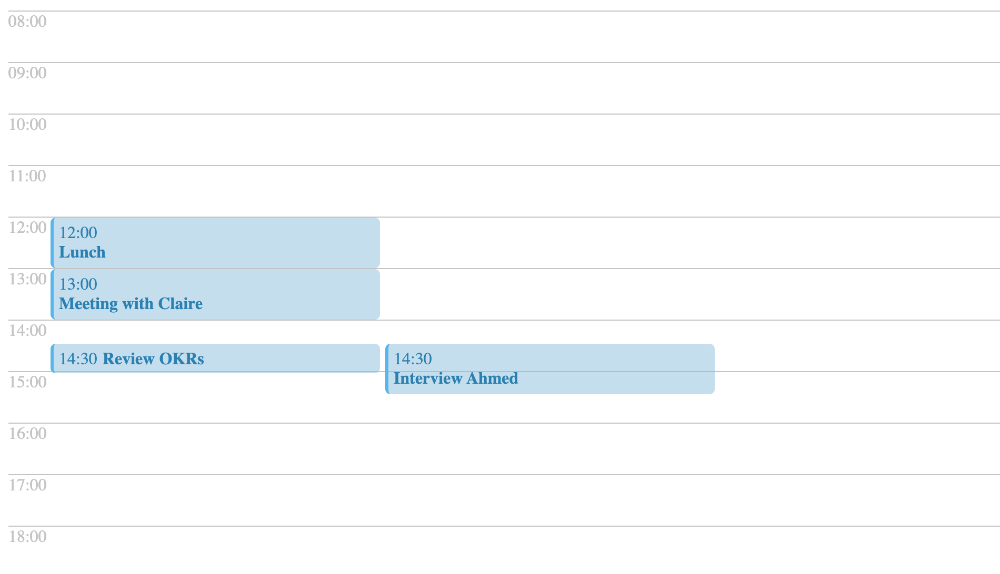

# Project Writeup

## What choices did you make and why?

- I chose to not use any 3rd party library.
- I decided to build a hash table with function `createTimeSlots` where the keys are the different times from 12am to 11pm and the value of each is an array of events that fall within that time period.
- The calendar view is built with just 3 components:

1. `Calendar` - Higher order component that displays all time slots and their associated events
2. `TimeSlot` - Displays a time Slot and its associated events
3. `Event` - Displays an event's start time and title

## What challenges did you face?

- Calculating the various heights and displaying them accurately
- Figuring out the best way to build the components to be simple

## What tradeoffs did you choose?

- Chose correctness over completness and handling every edge-cases given time constraints to work on the challenge

## What do you like and not like about your solution?

- I like that it's very simple to implement
- I don't like that it seems hacked together to some extent

## What areas would you work on next?

- Improve createTimeSlot function to handle more edge-cases or get a different way to implement same functionality
- Understand NestJs architecture and best practices so I can re-organize the code better
- Test components for edgecases
- Improve on styling